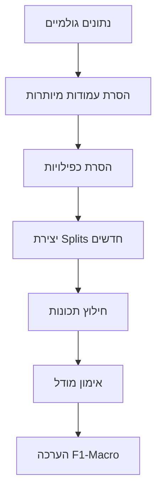

# 🔬 מסקנות מעניינות מניתוח הנתונים

## 📊 סיכום מהיר

| מדד | ערך |
|-----|-----|
| סה"כ דוגמאות | 35,496 |
| קטגוריות | 10 |
| אורך רצף ממוצע | 360 bp |
| יחס חוסר איזון | 3,407:1 |

---

## 💡 תובנות מפתיעות

### 1. 🧬 אורך הרצף חושף את סוג הגן!

| סוג גן | אורך ממוצע | תובנה |
|--------|------------|--------|
| **snoRNA** | 111 bp | הקצרים ביותר! |
| ncRNA | 266 bp | קצרים יחסית |
| BIOLOGICAL_REGION | 328 bp | בינוני |
| PSEUDO | 436 bp | ארוכים יחסית |
| **PROTEIN_CODING** | 742 bp | הארוכים ביותר! |

**מסקנה:** אורך הרצף לבדו יכול לנבא את סוג הגן בסבירות גבוהה!

---

### 2. 🏷️ השם חושף את התשובה (Data Leakage)

```
PSEUDO → 83.4% מסתיימים ב-"P"
BIOLOGICAL_REGION → 99.6% מתחילים ב-"LOC"
ncRNA → 70.6% מתחילים ב-"MIR"
```

**מסקנה:** אם נשתמש ב-Symbol, המודל פשוט ילמד לזהות תבניות בשם!

---

### 3. 📝 התיאור = התשובה עצמה!

| סוג גן | מכיל "pseudogene" | מכיל "RNA" |
|--------|-------------------|------------|
| PSEUDO | **92.98%** | 34% |
| snoRNA | 0.09% | **100%** |

**מסקנה:** Description הוא בעצם "רמאות" - הוא מכיל את שם הקטגוריה!

---

### 4. 🔄 הנתונים "דולפים" בין ה-Splits

```
Train → Test: 7,738 רצפים זהים!
Train → Val: 4,769 רצפים זהים!
```

**מסקנה:** המודל יראה נתוני Test בזמן האימון - התוצאות יהיו מוטות!

---

### 5. ⚖️ חוסר איזון קיצוני

```
PSEUDO:  10,220 דוגמאות  ████████████████████████████████████████
scRNA:        3 דוגמאות  █

יחס: 3,407:1 !
```

**מסקנה:** בלי טיפול, המודל יתעלם מקטגוריות נדירות!

---

## 🎯 המלצות מעשיות

### עמודות לשימוש:
| עמודה | המלצה | סיבה |
|-------|--------|------|
| NucleotideSequence | ✅ **להשתמש** | התכונה היחידה ה"כנה" |
| GeneType | ✅ **Target** | מה שרוצים לנבא |
| Symbol | ❌ להסיר | דליפת מידע |
| Description | ❌ להסיר | דליפת מידע חמורה |
| NCBIGeneID | ❌ להסיר | מזהה ייחודי |
| GeneGroupMethod | ❌ להסיר | ערך קבוע |
| Index | ❌ להסיר | מספר שורה |

### תכונות מומלצות לחילוץ:
1. **אורך רצף** - קורלציה חזקה עם סוג הגן
2. **GC Content** - אחוז G+C ברצף
3. **K-mer frequencies** - תדירות תת-רצפים
4. **One-hot encoding** - לרצפים קצרים

### מודלים מומלצים:
1. **CNN 1D** - מעולה לרצפי DNA
2. **LSTM/BiLSTM** - לתפיסת תלויות ארוכות
3. **Transformer** - state-of-the-art לרצפים

### מדדי הערכה:
- ✅ **F1-Score (Macro)** - מתחשב בכל הקטגוריות
- ✅ **Confusion Matrix** - להבנת טעויות
- ❌ ~~Accuracy~~ - מוטה בגלל חוסר האיזון

---

## 📈 ציפיות לביצועים

בהנחה שנשתמש רק ב-NucleotideSequence:

| מודל | F1 צפוי | הערות |
|------|---------|-------|
| Baseline (רוב) | ~0.10 | רק מנחש PSEUDO |
| Random Forest + K-mers | 0.40-0.55 | סביר |
| CNN 1D | 0.60-0.75 | טוב |
| LSTM/GRU | 0.65-0.80 | טוב מאוד |
| Transformer | 0.70-0.85 | מעולה |

**אזהרה:** אם נשתמש ב-Symbol/Description, נקבל ~95% - אבל זו רמאות!

---

## 🚀 צעדים הבאים



1. **ניקוי:** הסר Index, NCBIGeneID, GeneGroupMethod
2. **החלטה:** האם להשתמש ב-Symbol/Description? (לא מומלץ)
3. **תיקון Splits:** צור חלוקה חדשה ללא חפיפה
4. **איזון:** class_weight או SMOTE
5. **מודל:** התחל עם CNN פשוט
6. **הערכה:** F1-Macro, Confusion Matrix

---

## 📁 קבצים בתיקייה זו

| קובץ | תיאור |
|------|-------|
| `data_analysis_report.html` | דוח ויזואלי אינטראקטיבי |
| `interesting_conclusions.md` | קובץ זה |

---

*נוצר אוטומטית | תאריך: 2024-12-11*

